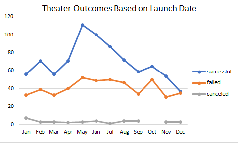
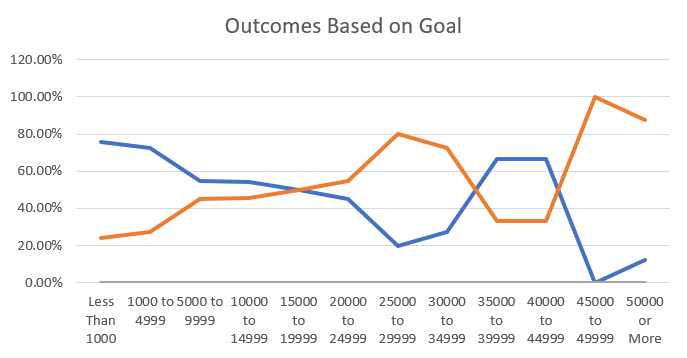

# Kickstarting with Excel

## Overview of Project
This project demonstrates the capability of Excel to analyze data and uncover trends relating to Kickstarter campaign data.
### Purpose
The purpose of this project is to assist a client (Louise) in deciding if or when to start a crowdfunding Kickstarter campaign for her play Fever.
## Analysis and Challenges
To create a palatable view of the project it was broken down into two main deliverables, outcomes based on launch date and outcomes based on goals.
### Analysis of Outcomes Based on Launch Date
The purpose of this analysis was to look at outcomes from the parent category of "theater" campaigns which was then further broken down into a subcategory of "plays", these were then filtered by year and month the campaigns started in. To achieve this, a pivot table was created to look at the "theater" category, the start month/year of every campaign, and the outcomes of the campaigns. The pivot table was filtered for "parent category" and "years", launch date for rows, and "outcomes" for values and columns. Once the pivot table was complete, it was used to create a line chart to visually show the outcomes based on which month the campaign began.

### Analysis of Outcomes Based on Goals
To analyze the Outcomes of "Plays" campaigns based on goals several things were done. First I made a table to sort the goals into three categorys, successful, failed , and canceled. Then the COUNTIFS function was used to fill the table based on each dollar range. Additionally the SUM function was used to obtain a total number of campaigns based on dollar range. Next percentages were calculated using the existing table data. Finally using the table as a source, I made a line chart to visualize the table data.

### Challenges and Difficulties Encountered
While creating this analysis I ran into a couple difficulties. Firstly while creating the pivot table for Outcomes Based on Launch Date I had issue filtering the pivot table by months rather then years. I was able to overcome this by googling and some trial and error. Additonally I ran into an issue when trying to create the data table for outcomes based on goals, my issue was with the COUNTIFS function. While attempting to add a range for the data based on specific dollar amounts I could not figure out how to add a range of numbers. I managed to overcome this through watching a video that explained how the function works. Finally getting the function to work the way I wanted was fulfilling. 
## Results

- What are two conclusions you can draw about the Outcomes based on Launch Date?
The largest conclusion drawn from this analysis was that May and June are the best months to start a campaign. May and June both had very high success rates with low failure rates. Another conclusion is that October, November, and December were the worst months to start a campaign. October had an abnormal failure rate, November had the second lowest success rate. December had the lowest success rate which almost equaled its failure rate.
- What can you conclude about the Outcomes based on Goals?

- What are some limitations of this dataset?

- What are some other possible tables and/or graphs that we could create?
